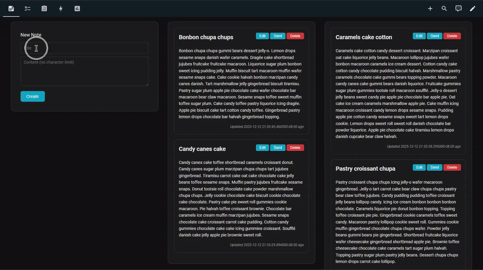
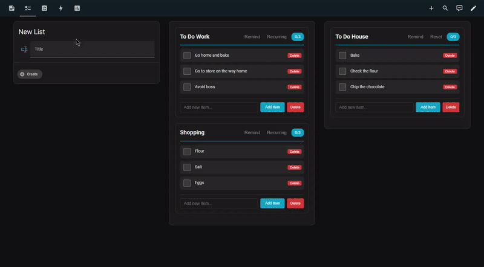
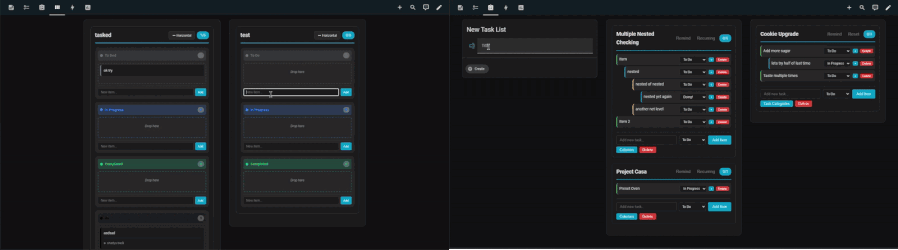
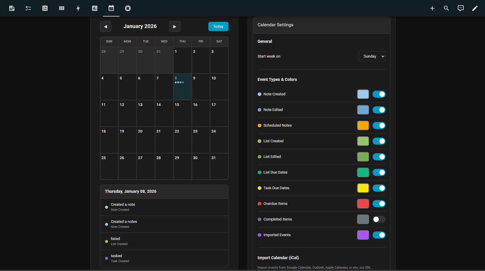
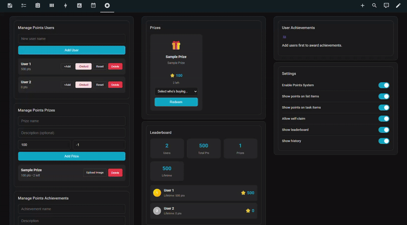

<p align="center">
   
  <br />
  <h1 align="center">JotTick</h1><br/>
</p>
<p align="center">
<i>Jot notes. Tick tasks. Sync calendars. Get Notified. Simple. Now with gamification.</i>
</p>

A notes, checklists, task management, calendar and chore/gamification integration for Home Assistant. Includes iCal support, per device and list notification controls along with powerful recurring list functionality. 

###### Notes Preview


###### Lists Preview


###### Tasks Preview (2 views standard and kanban)


###### Calendar Preview


###### Gamification/Chores Preview


### Demo
[Test drive the features at JotTick.com](https://jottick.com)

### New 1.5.2 1/08/26
- Version 1.5.2 Added Points and Rewards system for gamification/chores
  - Achievements: Trophies that auto award based on lifetime points. Create achievements with image upload.
  - Rewards/Prizes: Create an awards/prizes store with image upload.
  - Full History: Track points earned, spent, achievements and more. 
  - Admin Controls: Full admin controls including creating users, adding and removing points, and much more.
  - Full featured dashboard.  
- Version 1.5.2 Upgraded the calendar. Now imports into standard Home Assistant calendar.
  - Jottick Notes, Lists and Tasks now show up in Home Assistant calendar.
  - Use any calendar card you want now!
  - Full admin calendar settings on dashboard.
- Version 1.5.2 Clear Data buttons added to Quick Actions tab
- Version 1.5.2 [changelog.md](changelog.md)
- Version 1.5 Added calendar support for notes, lists and tasks. [demo here](https://jottick.com)
- Version 1.5 Added iCAL import and export for JotTick
- Version 1.5 Custom calendar dashboard added to JotTick
- Version 1.5 Much More [changelog.md](changelog.md)
- Version 1.4 Added Kanban drag and drop dashboard to task lists [demo here](https://jottick.com)
- Version 1.3 Assist, reminders and aliases oh my
- Natural Language Assist Reminders: No LLM needed
  - Add aliases (nicknames) for each device "Remind (alias) to X in an hour thirty" and [many more variations here](assist_README.md)
  - Add "me" for each device : "Remind me to X in 30 minutes" and [many more variations here](assist_README.md)
- Easy to Use Dashboard: Easily link devices and add aliases. [see here](assets/preview-reminders.png)
- Upgrade information and more changes available via [changelog.md](changelog.md)

### Notes
- Create, edit, and delete notes with images
- Dual column layout mimics popular masonry grids
- Send notes directly to mobile devices as notifications at any time
- Lightbox image viewer per note

### Checklists
- Create, edit, and delete checklists
- Check/uncheck items
- Add and remove items
- **Recurring resets** : automatically start a list over at any scheduled time(s)
- **Reminders** : Easy to use, per device, notification schedules on each note list and task
- 1.5 added due dates to list items for calendar view

### Tasks
- Task lists with customizable task statuses
- **Nested sub tasks** infinite levels of nested sub tasks
- Status tracking (To Do, In Progress, Completed, or make your own)
- **Cascade completion** : marking a task complete also completes its subtasks
- Recurring resets and reminders (same as checklists)
- Kanban functions and alternate task view
- 1.5 added due dates to taks items for calendar view

### Calendar
- Fully customizable calendar for JotTick
- Inlcudes notes, lists, tasks and imported events
- List and task items can now have due dates
- Import unlimited iCal calendars
- Full built dashboard
- Export HA calendar as .iCal

### Points and Rewards
- Gamification system for lists and tasks
- Create users for Points and Rewards
- Assign point values to list and task items
- Users claim points when completing items. Automated if set to user, manual if open bounty.
- Achievements auto award based on lifetime points
- Prizes with cost tracking and redemption
- Leaderboard shows rankings and lifetime points
- History tracks all point transactions
- Admin controls for managing users, prizes and achievements

### Dashboard
- Prebuilt dashboard with all features
- Follows your Home Assistant theme
- Mobile friendly design

## Requirements

### Home Assistant
- Version 2024.12 or newer

### HACS Frontend Components
* Will be needed now or for future plans
Install these via HACS → Frontend:

| Component | Required For |
|-----------|--------------|
| [html template card](https://github.com/PiotrMachowski/Home-Assistant-Lovelace-HTML-Jinja2-Template-card) | html template card |
| [lovelace multiline text input card](https://github.com/faeibson/lovelace-multiline-text-input-card) | Multi line text inputs |
| [lovelace html card](https://github.com/PiotrMachowski/lovelace-html-card) | Lovelace hthml card |

---

## Installation

### Step 1: Add Custom Repository to HACS

1. Open Home Assistant
2. Navigate to HACS in the sidebar
3. Click the three dots menu (top right)
4. Select "Custom repositories"
5. Add the repository:
6. Repository URL: https://github.com/gelatinescreams/JotTick
7. Category: Integration
8. Click "Add"

### Step 2: Install the Integration

#### Option A: HACS (Recommended)
1. Open HACS → Integrations
2. Click the three dots menu → Custom repositories
3. Add this repository URL and select "Integration"
4. Search for "JotTick" and install
5. Restart Home Assistant
6. Continue to step 3

#### Option B: Manual
1. Download the `jottick` folder from this repository
2. Copy it to `config/custom_components/jottick/`
3. Restart Home Assistant

### Step 3: Add the Integration
1. Go to **Settings → Devices & Services**
2. Click **Add Integration**
3. Search for "JotTick"
4. Click to add.

### Packages
1. It is highly recommebeded to use the package system. More information from Home Assistant about it [here](https://www.home-assistant.io/docs/configuration/packages/)
2. If you use the package system, a prebuilt package for Jottick is included and you scan skip to step 7.

### Step 4: Install Helper Entities
1. Copy the contents of `jottick_input_helpers.yaml` to your `configuration.yaml` or packages folder
2. Restart Home Assistant (or reload Input helpers)

### Step 5: Install Scripts
1. Copy the contents of `jottick_scripts.yaml` to your scripts configuration
2. Reload Scripts (Developer Tools → YAML → Reload Scripts)

### Step 6: Install Automations
1. Copy the contents of `jottick_automations.yaml` to your automations configuration
2. Reload Automations (Developer Tools → YAML → Reload Automations)

### Step 7: Create the Dashboard
1. Go to **Settings → Dashboards**
2. Click **Add Dashboard**
3. Name it "Notes AND Lists AND tasks OMG" (or whatever you prefer)
4. Open the new dashboard
5. Click the three dots menu → **Edit Dashboard**
6. Click the three dots again → **Raw configuration editor**
7. Paste the entire contents of `jottick_dashboard.yaml`
8. Save

---

## Usage

### Notes

**Create a Note:**
1. Go to the Notes tab
2. Enter a title and content
3. Click **Create**

**Edit a Note:**
1. Click **Edit** on any note card
2. Modify the title or content (no character limit!)
3. Click **Save**

**Send to Device:**
1. Click **Send** on any note card
2. Select one or more devices
3. Click **Send Note**

### Checklists

**Create a Checklist:**
Use the service `jottick.create_checklist` with a title:
```yaml
service: jottick.create_checklist
data:
  title: "Grocery List"
```

**Add Items:**
Type in the "Add new item..." field and click **Add Item**

**Check/Uncheck Items:**
Click the checkbox next to any item

**Set Up Recurring Reset:**
1. Click **Reset** on a checklist card
2. Select which days to reset
3. Choose a preset time or enter custom times (comma separated, 24h format)
4. Click **Save**

**Set Up Reminders:**
1. Click **Remind** on a checklist card
2. Select target devices
3. Set interval, active hours, and days
4. Click **Save**

### Tasks

**Create a Task List:**
Use the service `jottick.create_task` with a title:
```yaml
service: jottick.create_task
data:
  title: "Project Tasks"
```

**Add Items:**
Type in the "Add new task..." field, select a status, and click **Add Item**

**Add SubTasks:**
Click the **+** button on any task item to add a subtask beneath it

**Change Status:**
Use the dropdown on any task item to change its status

**Cascade Completion:**
When you mark a task as "Completed", all its direct subtasks are also marked completed

**Custom Statuses:**
1. Click **Columns** on a task card
2. Add new statuses with custom labels
3. Reorder or delete existing statuses

---

## Services

### Notes
| Service | Description |
|---------|-------------|
| `jottick.create_note` | Create a new note |
| `jottick.update_note` | Update note title/content |
| `jottick.delete_note` | Delete a note |
| `jottick.add_note_image` | Add image from base64 data |
| `jottick.add_note_image_from_path` | Add image from file path |
| `jottick.delete_note_image` | Delete image from note |
| `jottick.update_note_image_caption` | Update image caption |
| `jottick.reorder_note_images` | Reorder images in note |
| `script.jottick_send_note_to_devices` | Send note to selected devices |
| `script.jottick_schedule_note` | Schedule note for future delivery |
| `script.jottick_cancel_scheduled_note` | Cancel a scheduled send |

### Checklists
| Service | Description |
|---------|-------------|
| `jottick.create_checklist` | Create a new checklist |
| `jottick.update_checklist` | Update checklist title |
| `jottick.delete_checklist` | Delete a checklist |
| `jottick.add_checklist_item` | Add item to checklist |
| `jottick.delete_checklist_item` | Remove item from checklist |
| `jottick.check_item` | Mark item as checked |
| `jottick.uncheck_item` | Mark item as unchecked |
| `jottick.set_checklist_item_due_date` | Set due date on item |
| `jottick.clear_checklist_item_due_date` | Remove due date from item |
| `script.jottick_reset_checklist` | Uncheck all items |
| `jottick.check_all_items` | Mark all items as checked |
| `jottick.uncheck_all_items` | Mark all items as unchecked |

### Tasks
| Service | Description |
|---------|-------------|
| `jottick.create_task` | Create a new task list |
| `jottick.update_task` | Update task list title |
| `jottick.delete_task` | Delete a task list |
| `jottick.add_task_item` | Add item (optionally as subtask) |
| `jottick.delete_task_item` | Remove task item |
| `jottick.update_task_item_status` | Change item status |
| `jottick.set_task_item_due_date` | Set due date on item |
| `jottick.clear_task_item_due_date` | Remove due date from item |
| `jottick.create_task_status` | Add custom status column |
| `jottick.update_task_status` | Update a status column |
| `jottick.delete_task_status` | Remove a status column |
| `script.jottick_reset_task` | Reset all items to "todo" |

### Calendar & iCal
| Service | Description |
|---------|-------------|
| `jottick.import_ical` | Import events from iCal URL |
| `jottick.remove_ical_import` | Remove imported calendar |
| `jottick.refresh_ical_imports` | Manually refresh all imports |
| `jottick.export_ical` | Export JotTick data as iCal |

### Points and Rewards
| Service | Description |
|---------|-------------|
| `jottick.create_points_user` | Create a points user |
| `jottick.delete_points_user` | Delete a points user |
| `jottick.adjust_user_points` | Add or remove points from user |
| `jottick.reset_user_points` | Reset user points to zero |
| `jottick.set_item_points` | Set point value on list or task item |
| `jottick.claim_item_points` | Claim points for completing item |
| `jottick.create_prize` | Create a redeemable prize |
| `jottick.delete_prize` | Delete a prize |
| `jottick.redeem_prize` | Redeem prize for user |
| `jottick.create_achievement` | Create an achievement trophy |
| `jottick.update_achievement` | Update achievement details |
| `jottick.delete_achievement` | Delete an achievement |
| `jottick.award_achievement` | Award achievement to user |
| `jottick.revoke_achievement` | Remove achievement from user |
| `jottick.add_points_admin` | Add user as points admin |
| `jottick.remove_points_admin` | Remove user from points admins |

---

## Data Storage

All data is stored locally in:
```
config/.storage/jottick_data
```

This file contains all your notes, checklists, and tasks in JSON format. Back up this file to preserve your data.

---

## Sensors

JotTick creates sensors for each item:

| Sensor | State | Attributes |
|--------|-------|------------|
| `sensor.jottick_note_*` | Note title | content, note_id, timestamps |
| `sensor.jottick_checklist_*` | checked/total | items, flat_items, checklist_id |
| `sensor.jottick_task_*` | completed/total | items, flat_items, statuses, task_id |
| `sensor.jottick_total_notes` | Count | — |
| `sensor.jottick_total_checklists` | Count | — |
| `sensor.jottick_total_tasks` | Count | — |
| `sensor.jottick_scheduled_notes` | Count | schedules (dict of pending sends) |
| `sensor.jottick_overdue_items` | Count | overdue_items list |
| `sensor.jottick_imported_events` | Count | events, sources |
| `sensor.jottick_calendar_events` | Count | events by date |

---

## Recurring & Reminders

### How Recurring Resets Work
1. Configuration is stored in `input_text.jottick_recurring_configs`
2. An automation checks every minute if any reset is due
3. When triggered, all items are unchecked (checklists) or set to "todo" (tasks)

### How Reminders Work
1. Configuration is stored in `input_text.jottick_reminder_configs`
2. An automation checks at the configured interval
3. If unchecked/incomplete items remain during active hours, a notification is sent

### Preset Times
| Preset | Time(s) |
|--------|---------|
| Morning | 06:00 |
| Noon | 12:00 |
| Evening | 18:00 |
| Night | 21:00 |
| Midnight | 00:00 |
| Morning + Evening | 06:00, 18:00 |
| Three Times Daily | 08:00, 13:00, 20:00 |
| Every 6 Hours | 00:00, 06:00, 12:00, 18:00 |
---

## Credit where credit is due

Thank you to the creator of [Jotty](https://github.com/fccview/jotty) that started my journey into notes, lists and tasks. I also have a plugin that integrates Jotty with Home Assistant [Here](https://github.com/gelatinescreams/HA-HACS-Notes-and-Lists-Jotty-integration) and uses the same core features as this one.

## License

MIT License : see [LICENSE](LICENSE) for details.